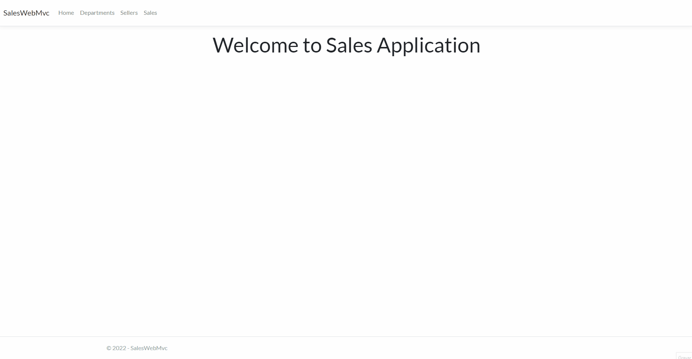

# SalesWebMvc

## GIF do projeto

## Sobre

Projeto de um board para cadastrar e consultar departamentos, vendedores e vendas. Construído no framework ASP.NET Core MVC, utilizando o Entity Framework Core para acesso e persistência de dados junto do banco de dados MySQL, e o Bootstrap para criação de templates.
